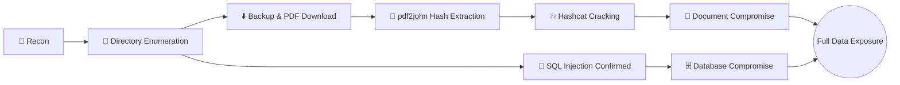

# 🏥 Mediroza Hospital — Web Application Penetration Testing Report

> **From Recon to Root: A Full-Chain Compromise via Exposed Backups and Weak Document Security**

| Field | Details |
|---|---|
| **Target** | `https://medirozahospital.com` |
| **Assessment Type** | Web Application Penetration Testing |
| **Report Date** | October 2, 2026 |
| **Classification** | Confidential |
| **Prepared By** | Jyotipriyo Saha |
| **Contact** | sjyotipriyo@gmail.com |

---

## 📋 Table of Contents

1. [Executive Summary](#-executive-summary)
2. [Scope](#-scope)
3. [Findings Summary](#-findings-summary)
4. [Detailed Findings](#-detailed-findings)
5. [Attack Chain Analysis](#-attack-chain-analysis)
6. [Recommendations / Remediation Plan](#-recommendations--remediation-plan)
7. [Tools & Methodology](#-tools--methodology-appendix)
8. [Conclusion](#-conclusion)
9. [Disclaimer](#-disclaimer)

---

## 🧭 Executive Summary

This report details the findings of a Web Application Penetration Test conducted against the **Mediroza Hospital** public-facing website. The objective of the engagement was to identify exploitable vulnerabilities that could compromise the confidentiality, integrity, or availability of the application and its underlying data.

The assessment uncovered a **critical, chainable attack path**: a publicly accessible legacy directory (`/old/`) exposed a database backup file and multiple internal PDF documents. Combined with a confirmed **SQL Injection** vulnerability on the primary application, an attacker could achieve full database compromise, exfiltrate Protected Health Information (PHI) / Personally Identifiable Information (PII), and bypass document-level password protection through offline credential cracking.

**Key risks identified:**

- 🔴 **SQL Injection** on the primary web application, enabling direct database manipulation and extraction.
- 🔴 **Exposed legacy/backup infrastructure** (`/old/`), serving as the initial foothold for the entire attack chain.
- 🔴 **Publicly accessible `.sql` database backup**, leaking patient records and credentials in plaintext.
- 🟠 **Sensitive PDF documents** protected by weak passwords, recoverable via offline hash cracking.

**Business Impact:** Given the healthcare context, exploitation of these vulnerabilities could result in large-scale **PHI/PII breach**, regulatory non-compliance (**HIPAA / GDPR**), reputational damage, and potential legal liability. Immediate remediation is strongly advised.

---

## 🎯 Scope

| Target Type | URL / Path |
|---|---|
| **Primary Website** | `https://medirozahospital.com` |
| **Legacy / Backup Directory** | `https://medirozahospital.com/old/` |

The assessment was limited to the web application and publicly accessible directories/files reachable from the above endpoints. No internal network, infrastructure, or social engineering testing was performed as part of this engagement.

---

## 📊 Findings Summary

| # | Severity | Finding | Count |
|---|:---:|---|:---:|
| 1 | 🔴 **Critical** | SQL Injection | 1 |
| 2 | 🔴 **Critical** | Exposed Legacy Directory | 1 |
| 3 | 🔴 **Critical** | Exposed Database Backup File (`.sql`) | 1 |
| 4 | 🟠 **High** | Sensitive PDF Documents (Password-Cracked) | 3 |

---

## 🔍 Detailed Findings

### FINDING #1 — SQL Injection Vulnerability
**Severity: 🔴 CRITICAL**

**Description**
The application is vulnerable to SQL Injection, allowing an attacker to manipulate backend database queries by injecting malicious input through user-controllable parameters.

**Affected URL / Location**
```
https://medirozahospital.com
```

**Impact**
- Unauthorized access to the backend database
- Data exfiltration of sensitive records
- Authentication bypass
- Complete database compromise

**Remediation**
- ✅ Implement parameterized queries / prepared statements
- ✅ Use a vetted ORM framework instead of raw SQL string concatenation
- ✅ Apply strict server-side input validation and sanitization
- ✅ Deploy a Web Application Firewall (WAF) as a compensating control

---

### FINDING #2 — Exposed Legacy Directory
**Severity: 🔴 CRITICAL**

**Description**
A legacy/backup directory was found to be publicly accessible, exposing outdated application code, configuration artifacts, and data that should never have been reachable from the internet.

**Affected URL / Location**
```
https://medirozahospital.com/old/
```

**Impact**
- Access to deprecated and potentially unpatched functionality
- Disclosure of internal system architecture
- Served as the **initial entry point** for the entire attack chain (see [Attack Chain Analysis](#-attack-chain-analysis))

**Remediation**
- ✅ Remove or restrict access to the `/old/` directory immediately
- ✅ If retained for operational reasons, enforce authentication + IP allow-listing
- ✅ Relocate all backup files outside the web root entirely

---

### FINDING #3 — Exposed Database Backup File
**Severity: 🔴 CRITICAL**

**Description**
A database backup file (`.sql`) was discovered inside the exposed `/old/` directory. The file contained highly sensitive data, including patient records, credential material, and internal system information — in plaintext and directly downloadable.

**Affected URL / Location**
```
https://medirozahospital.com/old/[filename].sql
```

**Impact**
- Complete database compromise without needing to exploit the live application
- Exposure of patient PII (Personally Identifiable Information)
- Credential theft (application and/or database accounts)
- Regulatory compliance violations (**HIPAA / GDPR**)

**Remediation**
- ✅ Immediately remove exposed SQL backup files from any web-accessible path
- ✅ Rotate **all** database credentials found in the backup
- ✅ Audit database access logs for signs of unauthorized access or prior exfiltration
- ✅ Implement secure, access-controlled backup storage practices (e.g., encrypted, off-web-root, access-logged)

---

### FINDING #4 — Sensitive PDF Documents (Password Protection Bypassed)
**Severity: 🟠 HIGH**

**Description**
Three (3) PDF documents containing sensitive hospital/internal information were discovered within the exposed directory structure. The documents were password-protected; however, the protection was defeated through offline hash extraction and cracking, demonstrating that the applied passwords were weak and insufficient as a control.

**Documents Found:** `3` PDF files

**Impact**
- Exposure of confidential hospital documents
- Potential disclosure of patient-related data
- Disclosure of internal business processes and procedures

**Remediation**
- ✅ Remove sensitive documents from publicly accessible storage
- ✅ Implement proper, role-based access controls for document repositories
- ✅ Encrypt sensitive files at rest using strong, modern encryption
- ✅ Enforce strong, unique passwords for any document-level protection (and treat it as a secondary control, not a substitute for access control)

---

## ⚔️ Attack Chain Analysis

The following attack path was successfully demonstrated end-to-end, illustrating how a single exposed directory escalated into full data compromise:

1. **Initial Reconnaissance** — Mapped the target application and identified the publicly accessible `/old/` legacy directory.
2. **Directory Enumeration** — Brute-forced the directory structure to enumerate hidden files and subdirectories within `/old/`.
3. **File Discovery** — Identified and downloaded an exposed database backup (`.sql`) and three PDF documents.
4. **Backup Analysis** — Parsed the `.sql` backup, revealing patient records, internal data, and credential material.
5. **PDF Hash Extraction** — Extracted the crackable hash from each password-protected PDF using `pdf2john`.
6. **Offline Password Cracking** — Cracked the extracted hashes using `hashcat`, recovering the PDF passwords and gaining full access to document contents.
7. **SQL Injection Validation** — Confirmed a SQL Injection vulnerability on the primary application, validating a second, independent path to full database compromise.
8. **Impact Validation** — Correlated findings to confirm a complete, realistic attack chain from unauthenticated recon to sensitive data exposure.



---

## 🛠 Recommendations / Remediation Plan

### 🚨 Immediate Actions (24–48 Hours)
1. ✅ Remove the `/old/` directory from public access
2. ✅ Delete exposed SQL backup files from all web-accessible locations
3. ✅ Rotate all database credentials discovered in the backup
4. ✅ Review and restrict access to the discovered PDF documents
5. ✅ Patch the confirmed SQL Injection vulnerability

### 🗓 Short-Term (1–2 Weeks)
- Deploy a Web Application Firewall (WAF)
- Conduct a full source code review targeting injection vulnerabilities
- Implement secure, automated backup procedures (encrypted, off-web-root)
- Enable directory listing/indexing protection across all web directories

### 📆 Long-Term (1–3 Months)
- Establish a recurring (quarterly/bi-annual) penetration testing program
- Implement security awareness training for development and IT staff
- Deploy a SIEM solution for centralized logging and monitoring
- Pursue relevant compliance certification (e.g., HIPAA technical safeguards audit)

---

## 🧰 Tools & Methodology (Appendix)

| Category | Tools / Techniques |
|---|---|
| **Directory Enumeration** | `ffuf` / `DirBuster` |
| **SQL Injection Testing** | Manual testing, SQLi testing tooling |
| **Credential/Hash Extraction** | `pdf2john` |
| **Offline Password Cracking** | `Hashcat` / `John the Ripper` |

**Methodology:** Testing followed an informal black-box approach aligned with industry-standard practices, consistent with the **OWASP Testing Guide** and **OWASP Top 10** categories.

**References:**
- [OWASP Top 10](https://owasp.org/www-project-top-ten/)
- [OWASP SQL Injection Prevention Cheat Sheet](https://cheatsheetseries.owasp.org/cheatsheets/SQL_Injection_Prevention_Cheat_Sheet.html)

---

## ✅ Conclusion

The Mediroza Hospital website exhibits **critical security vulnerabilities** that pose significant risk to patient data confidentiality and overall system integrity. The combination of SQL Injection, an exposed legacy directory, a publicly downloadable database backup, and weakly protected PDF documents forms a **complete, low-skill attack chain** capable of resulting in a large-scale data breach.

> **Overall Risk Rating: 🔴 CRITICAL — Immediate Action Required**

---

## ⚖️ Disclaimer

This assessment was conducted for **educational and authorized security research purposes** as part of a structured penetration testing training program. All testing activities were performed with the understanding that this is a **portfolio/demonstration exercise**. This document does not endorse or authorize unauthorized testing of any system. Always obtain **explicit written authorization** before conducting security assessments against any target.

---

<p align="center"><sub>Report prepared by <strong>Jyotipriyo Saha</strong> · sjyotipriyo@gmail.com</sub></p>
